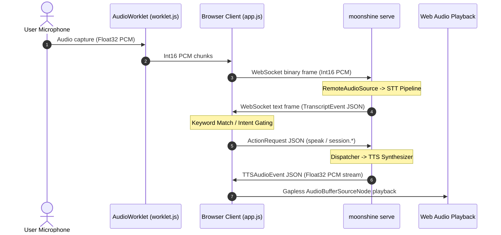

# samples/browser-cascade-faq — offline browser voice agent, zero install

A complete, zero-install, Tier 1 voice FAQ agent in JavaScript: captures your
microphone in the browser via `AudioWorklet`, streams PCM audio to
`moonshine serve`, matches spoken questions against `MISSION.md` content directly in
the browser tab, sends `speak` ActionRequests back over WebSocket, and plays
the returned synthesized `TTSAudioEvent` speech back through your laptop speakers
using the Web Audio API.

No build step, no framework, no server-side agent process in any language —
open `index.html` in a browser and the tab itself is the agent.

## Sample Rating

| Axis | Rating / Details |
|---|---|
| **Tier** | Tier 1 |
| **Complexity** | 3/5 |
| **Setup Cost** | Medium (requires browser with Web Audio microphone access + moonshine serve) |
| **Pillars** | Control, Privacy, Composability |
| **Industry / Use Case** | Customer Support, Kiosks, Offline Web Voice Agent |
| **Appeal** | 5/5 |

## What it demonstrates

- **Composability, maximally** — the strongest proof of the composability
  pillar from [docs/MISSION.md](../../docs/MISSION.md) in this repo: a static
  HTML page with no language runtime beyond what's built into every browser
  implements a full Tier 1 voice agent against `pkg/serveapi`'s wire contract.
- **Bi-directional remote voice cascade** — remote audio in (`AudioWorklet`
  int16 PCM binary frames) + remote TTS speech out (`TTSAudioEvent` float32 PCM
  decoded and played via Web Audio `AudioContext`).
- **Observability in the browser** — an on-page event log displaying wall-clock
  timestamps, STT latency (`Line.LastLatencyMs`), keyword hits/misses, and
  action dispatch round trips live.
- **Control** — fast-path regex commands ("stop listening", "resume listening")
  sending `session.pause`/`session.resume` actions back to the sidecar.

## Run it

Build/fetch `libmoonshine` first if you haven't (see repo root
[README](../../README.md)). Then, in one terminal, start `moonshine serve` with
remote audio and actions enabled:

```sh
cd ../..  # repo root
export MOONSHINE_LIB_DIR="$(pwd)/.moonshine/lib"
./bin/moonshine serve --transport ws --addr :8765 \
  --allow-actions \
  --agent external \
  --audio-source remote \
  --remote-audio-encoding int16 \
  --remote-audio-rate 16000 \
  --remote-audio-channels 1
```

Serve this directory over HTTP (browsers require HTTPS or `localhost` HTTP for `getUserMedia` mic access):

```sh
cd samples/browser-cascade-faq
python3 -m http.server 8080
```

Open `http://localhost:8080`, click **Connect**, then **Start speaking**.

Ask about **mission**, **cascade**, **privacy**, **control**,
**observability**, or **composability** — or say **"stop listening"** /
**"resume listening"**.

## Multi-Tenant Isolation & Resource Limits Demo

`moonshine serve`'s `SessionManager` (`#7br`) supports per-connection session isolation and a concurrency cap (`--max-sessions`). To verify multi-tenant isolation and enforcement:

1. Start `moonshine serve` with `--max-sessions 2`:

   ```sh
   ./bin/moonshine serve --transport ws --addr :8765 \
     --allow-actions --agent external --audio-source remote \
     --remote-audio-encoding int16 --remote-audio-rate 16000 \
     --max-sessions 2
   ```

2. Open `http://localhost:8080` in **Tab 1** and click **Connect** -> status displays `connected`.
3. Open `http://localhost:8080` in **Tab 2** and click **Connect** -> status displays `connected`.
   - Each tab runs an independent session with its own isolated transcript stream and TTS audio output.
4. Open `http://localhost:8080` in **Tab 3** and click **Connect** -> status displays `error connecting` / `disconnected (code 1008: serve: max session limit reached)`. The server enforces the session limit and rejects connection #3 cleanly.

> **Operational Note on Simultaneous Live Speech (Upstream #229):**
> While `SessionManager` cleanly isolates Go-side sessions (transcripts, event hubs, and action dispatchers), the underlying Moonshine C++ library currently shares a single static Silero VAD instance across all streams in a process ([moonshine-ai/moonshine#229](https://github.com/moonshine-ai/moonshine/issues/229)). Verifying connection limits and serialized speaking across tabs works cleanly; however, speaking simultaneously into multiple live microphones can corrupt recurrent VAD state and cause dropped lines or delayed finalization. For production deployments with multiple concurrent live microphones, run one `moonshine serve` process per stream (e.g. one container per client channel). See [docs/hosting.md](../../docs/hosting.md#sessions--one-per-connection-via---max-sessions).

## How it works



1. `worklet.js` captures Float32 PCM from the mic at 128-frame intervals,
   converts to int16 little-endian PCM, and posts buffers to the main thread.
2. `app.js` sends raw PCM buffers as binary WebSocket messages.
3. On finalized transcript lines, `app.js` checks for control commands
   (`stop listening` -> `session.pause`) or FAQ keywords (`mission` -> `speak`).
4. On a match, `app.js` sends an `ActionRequest` JSON frame (`{"verb": "speak", "args": {"text": "..."}}`).
5. When `moonshine serve` synthesizes TTS, it streams `TTSAudioEvent` JSON frames (`kind: "tts_audio"`):
   a `state: "start"` frame, followed by N `state: "chunk"` frames (each with float32 PCM in `audio_data`),
   and a terminal `state: "end"` (or `state: "interrupted"` on barge-in).
6. `app.js` schedules each chunk sequentially using Web Audio's timeline (`Math.max(audioCtx.currentTime, nextPlayTime)`)
   for gapless playback without overlap, and cancels active audio nodes if a barge-in interruption arrives.

## Streaming TTS Wire Behavior & Gapless Playback Pattern

With streaming TTS enabled (`v0.1.5+`), `moonshine serve` delivers synthesized speech as an incremental stream rather than waiting for full-utterance generation to complete. This dramatically lowers Time-to-First-Audio (TTFA).

### Wire Sequence

```
Client (ActionRequest "speak") ──▶ Server
Server ──▶ {"kind":"tts_audio", "payload":{"state":"start", "text":"..."}}
Server ──▶ {"kind":"tts_audio", "payload":{"state":"chunk", "audio_data":[...], "sample_rate":24000}}
Server ──▶ {"kind":"tts_audio", "payload":{"state":"chunk", "audio_data":[...], "sample_rate":24000}}
...
Server ──▶ {"kind":"tts_audio", "payload":{"state":"end"}}  (or "interrupted" on barge-in)
```

### Gapless Web Audio Scheduling Pattern

Because chunks arrive progressively over WebSocket, calling `source.start()` immediately without time coordinates causes all chunks to play concurrently at `audioCtx.currentTime`, resulting in garbled, overlapping sound. Additionally, using a dedicated playback context at the hardware default sample rate (rather than sharing the 16kHz microphone context) preserves full 24kHz acoustic fidelity without Nyquist cutoff at 8kHz.

The standard browser pattern tracks a `nextPlayTime` cursor on the `playbackCtx` timeline:
```javascript
let playbackCtx = null;
let nextPlayTime = 0;
const activeSources = new Set();

function getPlaybackContext() {
  if (!playbackCtx) {
    // Native device rate (e.g. 44.1kHz or 48kHz) avoids 8kHz Nyquist cutoff on 24kHz TTS
    playbackCtx = new AudioContext();
  }
  if (playbackCtx.state === "suspended") playbackCtx.resume();
  return playbackCtx;
}

function playChunk(samples, sampleRate) {
  const pCtx = getPlaybackContext();
  const buffer = pCtx.createBuffer(1, samples.length, sampleRate);
  buffer.getChannelData(0).set(samples);

  const source = pCtx.createBufferSource();
  source.buffer = buffer;
  source.connect(pCtx.destination);

  // Schedule chunk to start precisely when the prior chunk finishes
  const startAt = Math.max(pCtx.currentTime, nextPlayTime);
  source.start(startAt);
  nextPlayTime = startAt + buffer.duration;

  activeSources.add(source);
  source.onended = () => activeSources.delete(source);
}

function stopAllAudio() {
  for (const src of activeSources) {
    try { src.stop(); } catch (_) {}
  }
  activeSources.clear();
  if (playbackCtx) nextPlayTime = playbackCtx.currentTime;
}
```

See [../README.md](../README.md) for the full Tier 0/1/2 walkthrough this sample is part of.
