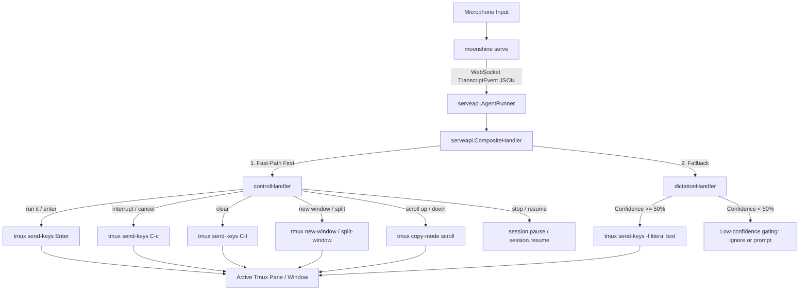

# samples/voice-tmux — voice-controlled terminal via tmux

A Tier 2 Go extension for `moonshine serve` that turns spoken input into terminal actions by bridging live transcripts to `tmux send-keys`. It enables hands-free voice control of any terminal emulator (including Ghostty, iTerm2, Kitty, Alacritty, and native Terminal) running a tmux session — with zero cgo, no Zig or Swift toolchains, and zero modifications to the core daemon.

## Sample Rating

| Axis | Rating / Details |
|---|---|
| **Tier** | Tier 2 (Go extension via `pkg/serveapi`) |
| **Complexity** | 3/5 |
| **Setup Cost** | Medium (requires local mic + moonshine serve + active tmux session) |
| **Pillars** | Control, Observability, Composability |
| **Industry / Use Case** | Developer Tooling, Terminal Automation, Accessibility |
| **Appeal** | 5/5 |

---

## What It Demonstrates

1. **Hybrid Voice Model (Fast-Path Controls + Fallback Dictation):** Spoken input matches deterministic control verbs *first* (`run it`, `interrupt`, `clear`, `new window`, `split right`, `scroll up`). Any other spoken text is treated as literal dictation and typed into the active shell.
2. **Deterministic Safety:** Dictated commands **never auto-execute** — a command only runs when you explicitly say *"run it"* or *"enter"*.
3. **Confidence Gating (`Line.MeanConfidence`):** Low-confidence transcriptions are rejected before reaching your live shell, preventing speech misrecognitions from typing unwanted characters.
4. **Decoupled Architecture (`pkg/serveapi`):** Built entirely on public Go packages with `CGO_ENABLED=0`, consuming `serveapi.TranscriptEvent` and emitting `serveapi.ActionRequest` frames over WebSocket.

---

## Architecture



---

## Voice to Action Mapping

| Spoken Phrase (Case-Insensitive) | Tmux / Sidecar Action | Description |
|---|---|---|
| *(any other text)* | `tmux send-keys -l "<text> "` | Types literal text into the active pane (never sends Enter) |
| **"run it"** / **"execute"** / **"enter"** | `tmux send-keys Enter` | Executes the currently typed command in the shell |
| **"interrupt"** / **"cancel"** / **"control c"** | `tmux send-keys C-c` | Sends `SIGINT` (Ctrl-C) to abort running processes |
| **"clear"** / **"clear screen"** | `tmux send-keys C-l` | Clears the active terminal screen (Ctrl-L) |
| **"new window"** / **"new tab"** | `tmux new-window` | Creates a new tmux window in the active session |
| **"split"** / **"split right"** | `tmux split-window -h` | Splits the current window into side-by-side panes |
| **"split down"** | `tmux split-window -v` | Splits the current window into stacked panes |
| **"next window"** / **"prev window"** | `tmux next-window` / `previous-window` | Cycles through active tmux windows |
| **"scroll up"** / **"scroll down"** | `tmux copy-mode -u` / `PageDown` | Enters copy-mode and scrolls history |
| **"stop listening"** / **"pause listening"** | `session.pause` ActionRequest | Pauses sidecar STT ingestion |
| **"resume listening"** / **"start listening"** | `session.resume` ActionRequest | Resumes sidecar STT ingestion |

---

## Safety Controls

A voice-to-shell bridge must never execute unintended commands in a live shell:

1. **No Auto-Execution:** Spoken sentences are typed into the shell input buffer using literal escaping (`tmux send-keys -l`). They sit on the command line for visual inspection until you say *"run it"*.
2. **Dry-Run Mode (`-dry-run`):** Prints tmux commands to stdout without executing them, allowing you to test voice recognition safely.
3. **Confidence Gating (`-min-confidence`):** Evaluates `line.MeanConfidence()` (default 0.50). Transcripts below the threshold are discarded with a log message.
4. **Voice Confirmation (`-speak-confirm`):** Emits a `speak` ActionRequest through sidecar TTS, announcing *"Running"* when executing a command, or *"Please repeat"* when confidence is low.

---

## Quickstart

### 1. Prerequisites

- `tmux` installed and available on your PATH (`brew install tmux` or `apt-get install tmux`)
- `moonshine` CLI built and an STT model downloaded (see repo [README](../../README.md))

### 2. Start a Tmux Session

Open your terminal emulator (e.g. Ghostty or iTerm2) and start or attach to a tmux session:

```sh
tmux new -s voice
```

Split the window into two panes (`Ctrl-b "` or `Ctrl-b %`).

### 3. Start `moonshine serve` (Pane 1)

In the first pane, start the voice daemon with actions enabled:

```sh
cd ../.. # repo root
export MOONSHINE_LIB_DIR="$(pwd)/.moonshine/lib"
./bin/moonshine serve --transport ws --addr :8765 --allow-actions --agent external
```

### 4. Run `voice-tmux` (Pane 2)

In the second pane (or another window), run `voice-tmux`:

```sh
cd samples/voice-tmux
go run . -addr ws://localhost:8765/ws
```

### 5. Speak to Your Terminal!

1. Say: `"git status"` → Notice `git status ` appears on your command line.
2. Say: `"run it"` → Sends `Enter`, running `git status`.
3. Say: `"split right"` → Splits your window horizontally into a new pane.
4. Say: `"clear"` → Clears the screen.
5. Say: `"stop listening"` → Pauses transcription until you say `"resume listening"`.

### Optional Flags

```sh
# Dry run mode (print commands, do not execute):
go run . -dry-run

# Target a specific pane or window:
go run . -target "voice:0.1"

# Enable voice feedback and set a strict 75% confidence threshold:
go run . -speak-confirm -min-confidence 0.75

# Verbose debug logging:
go run . -debug
```

---

## Future Work: Native GUI Embedding (libghostty)

libghostty's C API (`include/ghostty.h`) is currently designed as an unstable GUI surface-rendering API requiring a Swift/AppKit (macOS) or Zig/GTK4 (Linux) embedding host. When upstream libghostty stabilizes a headless injection API, a native Ghostty embedding sample will be added to complement this tmux bridge.
