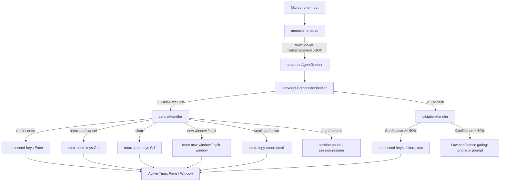

# samples/voice-tmux — voice-controlled terminal via tmux

A Tier 2 Go extension for `moonshine serve` that turns spoken input into terminal actions by bridging live transcripts to `tmux send-keys`. It enables hands-free voice control of any terminal emulator (including Ghostty, iTerm2, Kitty, Alacritty, and native Terminal) running a tmux session — with zero cgo, no Zig or Swift toolchains, and zero modifications to the core daemon.

## Sample Rating

| Axis | Rating / Details |
|---|---|
| **Tier** | Tier 2 (Go extension via `pkg/serveapi`) |
| **Complexity** | 3/5 |
| **Setup Cost** | Medium (requires local mic + moonshine serve + active tmux session) |
| **Pillars** | Control, Observability, Composability |
| **Industry / Use Case** | Developer Tooling, Terminal Automation, Accessibility |
| **Appeal** | 5/5 |

---

## What It Demonstrates

1. **Hybrid Voice Model (Fast-Path Controls + Fallback Dictation):** Spoken input matches deterministic control verbs *first* (`run it`, `interrupt`, `clear`, `new window`, `split right`, `scroll up`). Any other spoken text is treated as literal dictation and typed into the active shell.
2. **Deterministic Safety:** Dictated commands **never auto-execute** — a command only runs when you explicitly say *"run it"* or *"enter"*.
3. **Confidence Gating (`Line.MeanConfidence`):** Low-confidence transcriptions are rejected before reaching your live shell, preventing speech misrecognitions from typing unwanted characters.
4. **Decoupled Architecture (`pkg/serveapi`):** Built entirely on public Go packages with `CGO_ENABLED=0`, consuming `serveapi.TranscriptEvent` and emitting `serveapi.ActionRequest` frames over WebSocket.

---

## Architecture



---

## Voice to Action Mapping

| Spoken Phrase (Case-Insensitive) | Tmux / Sidecar Action | Description |
|---|---|---|
| *(any other text)* | `tmux send-keys -l "<text> "` | Types literal text into the active pane (never sends Enter) |
| **"run it"** / **"execute"** / **"enter"** | `tmux send-keys Enter` | Executes the currently typed command in the shell |
| **"interrupt"** / **"cancel"** / **"control c"** | `tmux send-keys C-c` | Sends `SIGINT` (Ctrl-C) to abort running processes |
| **"clear"** / **"clear screen"** | `tmux send-keys C-l` | Clears the active terminal screen (Ctrl-L) |
| **"new window"** / **"new tab"** | `tmux new-window` | Creates a new tmux window in the active session |
| **"split"** / **"split right"** | `tmux split-window -h` | Splits the current window into side-by-side panes |
| **"split down"** | `tmux split-window -v` | Splits the current window into stacked panes |
| **"next window"** / **"prev window"** | `tmux next-window` / `previous-window` | Cycles through active tmux windows |
| **"scroll up"** / **"scroll down"** | `tmux copy-mode -u` / `PageDown` | Enters copy-mode and scrolls history |
| **"stop listening"** / **"pause listening"** | Client-side pause | Ignores dictation and commands until unpaused |
| **"resume listening"** / **"start listening"** | Client-side resume | Resumes listening for shell commands |

---

## Safety Controls

A voice-to-shell bridge must never execute unintended commands in a live shell:

1. **No Auto-Execution:** Spoken sentences are typed into the shell input buffer using literal escaping (`tmux send-keys -l`). They sit on the command line for visual inspection until you say *"run it"*.
2. **Dictation Normalization:** Moonshine emits capitalized sentence prose with trailing punctuation (e.g. `"Git status."`). `voice-tmux` automatically strips trailing sentence punctuation (`.`, `?`, `!`, `,`, `;`) and lowercases the initial character unless it is a recognized acronym (e.g. `"Git status."` becomes `git status`, while `"NPM install"` and `"K8S"` retain their casing). Use `-raw` to disable normalization when dictating prose.
3. **Target Pane Requirement:** To prevent typing keystrokes into unintended windows (such as voice-tmux's or the daemon's own terminal), `-target` is required unless running with `-dry-run`. If omitted, voice-tmux lists all active tmux panes to help you pick the right target.
4. **Dry-Run Mode (`-dry-run`):** Prints tmux commands to stdout without executing them, allowing you to test voice recognition safely.
5. **Confidence Gating (`-min-confidence`):** Evaluates `line.MeanConfidence()` (default 0.50). Transcripts below the threshold are discarded with a log message.
6. **Voice Confirmation (`-speak-confirm`):** Emits a `speak` ActionRequest through sidecar TTS, announcing *"Running"* when executing a command, or *"Please repeat"* when confidence is low.
7. **Voice & Keyboard Resume:** In `moonshine serve`, the server-side `session.pause` action mutes the microphone at the audio driver level (`internal/serve/server.go`). Because mic input is silenced, the speech model cannot transcribe *"resume listening"*, making server-side voice unpause impossible. To allow natural voice-driven resumption, `voice-tmux` manages pause state client-side: local transcription continues, but all shell typing is discarded until you say *"resume listening"*. You can also press `Enter` in the `voice-tmux` terminal window at any time to resume.

---

## Quickstart

### 1. Prerequisites

- `tmux` installed and available on your PATH (`brew install tmux` or `apt-get install tmux`)
- `moonshine` CLI built and an STT model downloaded (see repo [README](../../README.md))

### 2. Start a Tmux Session with a 3-Pane Layout

Open your terminal emulator (e.g. Ghostty or iTerm2) and create a dedicated tmux session:

```sh
tmux new -s voice
```

Split the window so you have three panes (e.g. `Ctrl-b %` to split vertically, then `Ctrl-b "` to split one side horizontally):
- **Pane `voice:0.0`:** Your working shell (the voice-controlled workload pane)
- **Pane `voice:0.1`:** `moonshine serve` daemon
- **Pane `voice:0.2`:** `voice-tmux` bridge

### 3. Start `moonshine serve` (Pane 1)

In the second pane (`voice:0.1`), start the voice daemon with actions enabled:

```sh
cd ../.. # repo root
export MOONSHINE_LIB_DIR="$(pwd)/.moonshine/lib"
./bin/moonshine serve --transport ws --addr :8765 --allow-actions --agent external --arch small-streaming
```

> **Why `--agent external`?** Tells the daemon *not* to run its own built-in LLM or dialog rules, ensuring only `voice-tmux` interprets and executes actions on transcripts.  
> **Why `--arch small-streaming`?** Provides significantly higher vocabulary precision for technical commands than `tiny` while maintaining real-time streaming latency.

### 4. Run `voice-tmux` (Pane 2)

First, test safely in **dry-run mode** to see recognized commands without executing:

```sh
cd samples/voice-tmux
go run . -dry-run
```

Once confirmed, target your working shell pane (`voice:0.0`):

```sh
go run . -target "voice:0.0"
```

### 5. Speak to Your Terminal!

1. Say: `"git status"` → Notice `git status ` appears on your command line in pane `voice:0.0`.
2. Say: `"run it"` → Sends `Enter`, running `git status`.
3. Say: `"split right"` → Splits your window horizontally into a new pane.
4. Say: `"clear"` → Clears the screen.
5. Say: `"stop listening"` → Pauses transcription until you say `"resume listening"`.

---

## Recognition Accuracy, Keyterms & Command Aliases

General-purpose acoustic models are trained on conversational speech corpora where words like *"git"*, *"npm"*, and *"kubectl"* are rare compared to common English words (*"get"*, *"cube"*). To provide a reliable terminal experience, `voice-tmux` applies a two-layer mitigation:

### 1. Automatic Keyterm Biasing (`session.set_keyterms`)
On startup, `voice-tmux` sends an ActionRequest to `moonshine serve` applying logit bonuses to common CLI tools:
`git`, `npm`, `kubectl`, `docker`, `grep`, `sudo`, `ls`, `cd`, `make`, `cargo`, `pnpm`, `yarn`, `cat`, `echo`, `ssh`.
- Customize via `-keyterms "git,docker,make..."`
- Disable via `-no-keyterms`

*(Note: Keyterm biasing requires a streaming model such as `small-streaming` or `tiny-streaming`; static models like `tiny` and `base` do not support runtime logit biasing).*

### 2. Command Prefix Alias Table
Because conversational priors for *"get"* remain very strong even with keyterms, `voice-tmux` inspects the **leading command word** of each line:
- `get status` / `commit` / `diff` / `push` / `pull` / `add` → `git <cmd>`
- `cubectal` / `cube control` / `cube cuddle` → `kubectl`
- `nnmm` / `nmm` / `and pm` → `npm`

Rewrites are logged explicitly:
`[alias] "Get status" -> "git status"`

Safety guarantee: Aliases **only match at the start of a command line**. Saying *"I want to get coffee"* or *"Please get commit history"* is left completely untouched.
- Disable prefix rewriting via `-no-aliases`
- Disable all formatting/normalization via `-raw`

### Empirical Recognition Across Architectures

| Spoken Phrase | `tiny` (static) | `tiny-streaming` | `small-streaming` (with aliases) |
|---|---|---|---|
| **"git status"** | `Get status.` | `Get status.` | `git status` |
| **"git commit"** | `Get commit.` | `Get commit.` | `git commit` |
| **"npm install"** | `And an mm install.` | `NMM install.` | `npm install` |
| **"kubectl get pods"** | `Q-Bictile Get Pods` | `Cubectal get pods.` | `kubectl get pods` |

---

### Optional Flags

```sh
# Dry run mode (print commands, do not execute):
go run . -dry-run

# Target a specific pane or window (required unless -dry-run):
go run . -target "voice:0.0"

# Disable command prefix acoustic alias rewriting:
go run . -target "voice:0.0" -no-aliases

# Custom keyterm biasing list:
go run . -target "voice:0.0" -keyterms "git,terraform,ansible,make"

# Disable automatic keyterm registration:
go run . -target "voice:0.0" -no-keyterms

# Preserve unnormalized punctuation and uppercase prose:
go run . -target "voice:0.0" -raw

# Enable voice feedback and set a strict 75% confidence threshold:
go run . -target "voice:0.0" -speak-confirm -min-confidence 0.75

# Verbose debug logging:
go run . -target "voice:0.0" -debug
```

---

## Future Work: Native GUI Embedding (libghostty)

libghostty's C API (`include/ghostty.h`) is currently designed as an unstable GUI surface-rendering API requiring a Swift/AppKit (macOS) or Zig/GTK4 (Linux) embedding host. When upstream libghostty stabilizes a headless injection API, a native Ghostty embedding sample will be added to complement this tmux bridge.
